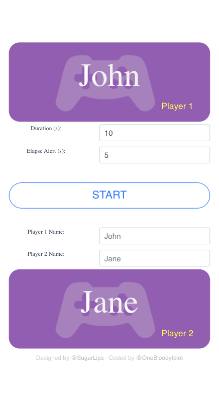

# Games Timer
A timer for games played on blitz mode. Each player has a set time to make a move in each round

[](https://app.netlify.com/sites/mystifying-williams-688592/deploys)

## Demo
- [Games Timer Link 1](https://timer.acelords.space/)
- [Games Timer Link 2](https://games-timer.acelords.space/)
- [Games Timer Link 3](https://mystifying-williams-688592.netlify.app/)



## Project setup
```
npm install
```

### Compiles and hot-reloads for development
```
npm serve
```

### Compiles and minifies for production
```
npm build
```

### Lints and fixes files
```
npm lint
```

### Customize configuration
See [Configuration Reference](https://cli.vuejs.org/config/).


